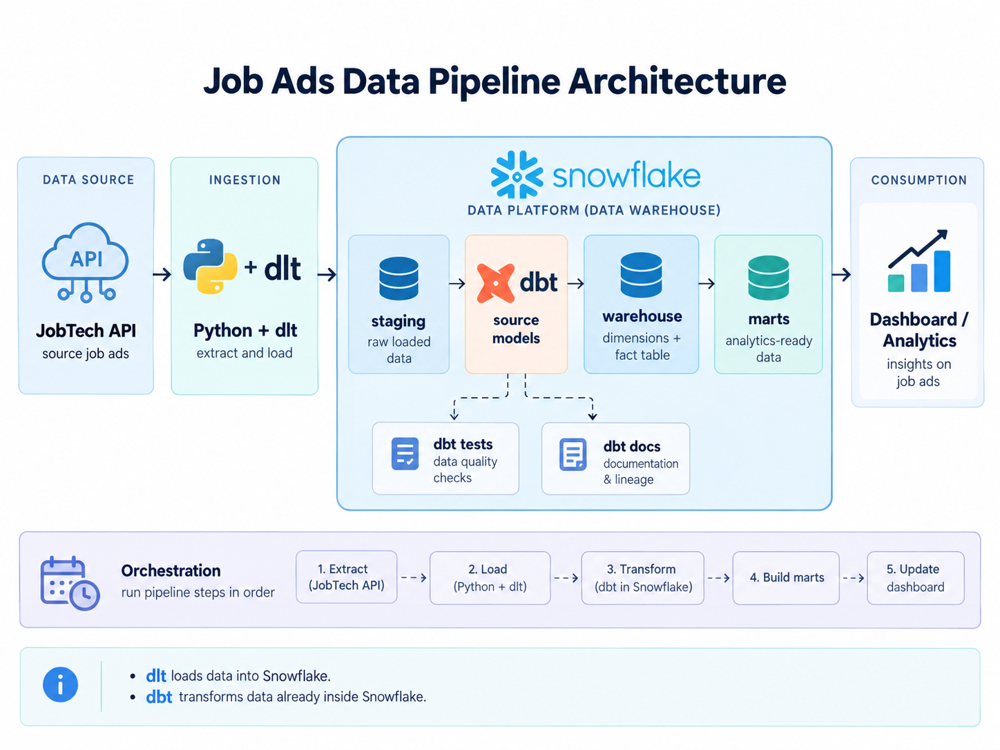

# AiraTheSnowFairy — Data Warehouse Lifecycle

A hands-on learning repository that follows the modern data warehouse lifecycle: Snowflake foundations and access control, ELT ingestion, dimensional modeling, dbt transformation and quality checks, analytics delivery, and pipeline orchestration.

## About This Repository

This educational repository supports my **Data Engineering Program → Data Warehouse Lifecycle course**. It contains my own implementations, exercises, experiments, notes, and code created to understand concepts introduced in class. The folders follow the course progression while reflecting my own learning process and implementation choices.

## Modern Data Stack Overview

```text
CSV files / Jobtech API
          ↓
      Python + dlt
          ↓
 Snowflake staging layer
          ↓
          dbt
          ↓
Snowflake warehouse models
          ↓
      Data marts
          ↓
Streamlit / analytics consumers

Dagster orchestrates the ingestion and transformation workflow.
```



## Repository Guide

The numbered folders build on one another. Each folder contains the scripts, models, exercises, or supporting notes for that stage of the course.

| Folder | What I learn / What it contains |
| --- | --- |
| [`00_intro`](00_intro/) | Snowflake fundamentals: worksheets for introductory queries, virtual warehouses, and an initial exercise. |
| [`05_users_and_roles`](05_users_and_roles/) | Snowflake users, custom roles, grants, role hierarchies, RBAC, and the principle of least privilege. |
| [`06_extract_load_csv_dlt`](06_extract_load_csv_dlt/) | Loading a Netflix CSV into a Snowflake staging schema with Python, pandas, and dlt, then validating the result with SQL. |
| [`07_extract_load_api_dlt`](07_extract_load_api_dlt/) | Exploring the Jobtech API and building a dlt pipeline that loads job-ad data into Snowflake with a dedicated service account. |
| [`08_dimensional_modeling`](08_dimensional_modeling/) | Designing star schemas and data marts in DBML, including healthcare and job-ad fact/dimension models. |
| [`09_setup_dbt`](09_setup_dbt/) | Preparing Snowflake roles, warehouses, and marts for dbt; configuring a dbt project; and introducing models, packages, and macros. |
| [`09_lecture_dbt`](09_lecture_dbt/) | A lecture implementation that connects dlt-loaded job ads to dbt staging/refined models and reusable Jinja macros. |
| [`10_dbt_modeling_documentation`](10_dbt_modeling_documentation/) | Transforming staged job ads into source, dimension, fact, and mart models with surrogate keys, tests, lineage, and generated dbt documentation. |
| [`11_dbt_testing_documentation`](11_dbt_testing_documentation/) | Strengthening data quality with built-in and package-based generic tests, singular SQL tests, relationships, and dbt documentation. |
| [`12_dashboard_streamlit`](12_dashboard_streamlit/) | Serving analytics-ready mart data through a Streamlit dashboard using a restricted Snowflake reporter role. |
| [`14_orchestration_dagster`](14_orchestration_dagster/) | Orchestrating dlt ingestion and dbt transformations with Dagster assets, jobs, schedules, sensors, resources, and definitions. |

The root-level [`exercises`](exercises/) and [`documentations`](documentations/) directories contain practice work and longer reference notes that support these learning stages.

## Tools & Technologies

| Tool | Why it is used |
| --- | --- |
| Snowflake | Provides cloud storage and compute for staging data, warehouse models, data marts, and role-based access control. |
| Python | Supports data extraction, API exploration, ingestion scripts, dashboard code, and orchestration definitions. |
| dlt | Builds repeatable pipelines that extract CSV or API data and load it into Snowflake. |
| dbt | Transforms staged data into documented, tested warehouse and mart models with SQL and Jinja. |
| SQL | Creates and secures Snowflake objects, validates loaded data, and defines transformations and tests. |
| pandas / PyArrow | Help read tabular files and support CSV/Parquet data handling during ingestion. |
| DBML / dbdiagram | Expresses dimensional models and visualizes relationships between facts and dimensions. |
| Streamlit | Presents analytics-ready Snowflake data in an interactive dashboard. |
| Dagster | Coordinates dlt and dbt assets and demonstrates jobs, schedules, sensors, and monitoring. |
| Git / GitHub | Tracks the learning work and organizes it as a navigable course repository. |

## Youtube Explanation Video
[](https://www.youtube.com/watch?v=AVvQHou9-gM&t=818s)
## How the Parts Connect

```text
Source data
→ Python and dlt extract and load it
→ Snowflake keeps the staged data
→ dbt cleans, transforms, tests, and documents it
→ dimensional models organize facts and dimensions
→ marts expose focused, analytics-ready datasets
→ Streamlit consumes those datasets
→ Dagster coordinates the pipeline steps
```

Each tool has a separate responsibility: **dlt** handles ingestion, **Snowflake** supplies storage and compute, **dbt** owns in-warehouse transformation and quality checks, **Streamlit** handles consumption, and **Dagster** manages workflow dependencies and execution.

## Key Concepts Covered

- **Warehouse foundations:** Snowflake databases, schemas, virtual warehouses, service users, RBAC, grants, role inheritance, and least privilege.
- **ELT and ingestion:** CSV and API extraction, dlt resources and pipelines, write dispositions, secrets, and staging layers.
- **Data modeling:** dimensional modeling, star schemas, grain, facts, dimensions, surrogate keys, warehouse layers, and data marts.
- **dbt development:** sources, `ref()`, model dependencies, materializations, Jinja/macros, packages, staging/source models, dimensions, facts, and marts.
- **Data quality and discoverability:** generic tests, singular tests, relationship tests, model descriptions, generated documentation, and lineage.
- **Delivery and operations:** read-only analytics access, Streamlit dashboards, Dagster assets, jobs, schedules, sensors, and orchestration.

## Suggested Learning Order

```text
Snowflake foundations and access control
00 → 05
   ↓
ELT ingestion from files and APIs
06 → 07
   ↓
Dimensional modeling
08
   ↓
dbt setup, transformation, and macros
09
   ↓
Modeling, testing, and documentation
10 → 11
   ↓
Analytics delivery
12
   ↓
Pipeline orchestration
14
```

**First visit?** Start with [`00_intro`](00_intro/) for Snowflake basics, then move through the numbered folders in order. If Snowflake is already familiar, begin with [`05_users_and_roles`](05_users_and_roles/) before building the ingestion pipeline in folders `06` and `07`.

## Quick Reference

Create and activate a virtual environment, then install the core ingestion dependencies:

```bash
uv venv

# macOS / Linux
source .venv/bin/activate

# Windows (Git Bash)
source .venv/Scripts/activate

uv pip install "dlt[snowflake,parquet]" ipykernel pandas
```

Useful checks:

```bash
uv pip list
dlt --version
```

Credentials belong in local secret files such as `.dlt/secrets.toml` or `.env`; do not commit them. The original lecture note records the dlt password setup at **04:15** in the relevant lecture video.

## Visual Reference

The dimensional model used by the job-ad transformation exercises:


## Further Reading

- [The Missing Piece of the Modern Data Stack](https://benn.substack.com/p/metrics-layer)
- More focused lecture links, official documentation, setup steps, and commands are retained in each folder's README.
