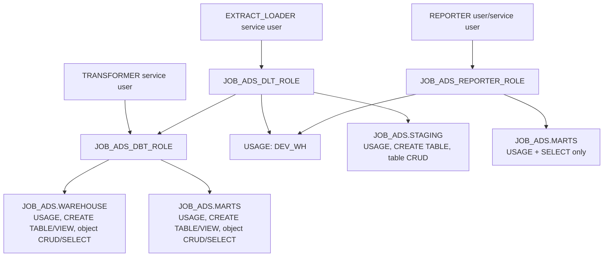

# 2. Snowflake foundation and least-privilege access

## Concepts and actual objects

The final pipeline uses compute warehouse `DEV_WH`, database `JOB_ADS`, and schemas `STAGING`, `WAREHOUSE`, and `MARTS`. Its identities and roles are:

| Identity | Kind | Role | Purpose |
|---|---|---|---|
| your Snowflake login (`AIRATHESNOWFAIRY` in checked-in examples) | human | `JOB_ADS_DBT_ROLE` for development; optionally dlt/reporter roles | interactive work |
| `EXTRACT_LOADER` | service user | `JOB_ADS_DLT_ROLE` | dlt writes staging |
| `TRANSFORMER` | service user | `JOB_ADS_DBT_ROLE` | dbt reads staging and builds warehouse/marts |
| `REPORTER` | password user **or** service user (two competing examples) | `JOB_ADS_REPORTER_ROLE` | dashboard reads marts only |

**Least privilege** means each identity receives only what its task needs. The reporter can select from marts but cannot modify them; dlt can modify staging; dbt inherits dlt's staging access and can build warehouse/marts.



## Correct execution order

### 1. Create compute

`DEV_WH` is created in the earlier learning script `05_users_and_roles/01_setup_dwh.sql` as XSMALL, auto-suspending after 60 seconds and auto-resuming. This is a supporting file: the canonical `10_dbt_modeling/sql/` assumes the warehouse already exists.

Run its `CREATE WAREHOUSE` statement as `SYSADMIN`, or create the equivalent warehouse in the Snowflake UI. A warehouse is compute, not storage.

### 2. Create the database, landing schema, dlt role, and dlt user

Run `07_extract_load_api_dlt/sql/01_setup_database.sql`, then `07_extract_load_api_dlt/sql/setup_service_acc.sql`. These are earlier lessons but remain prerequisites missing from `10_dbt_modeling/sql/`.

They create:

- `JOB_ADS` and `JOB_ADS.STAGING`;
- `JOB_ADS_DLT_ROLE` and `EXTRACT_LOADER`;
- role `USAGE` on `DEV_WH`, `JOB_ADS`, and `JOB_ADS.STAGING`;
- `CREATE TABLE` on staging;
- `SELECT`, `INSERT`, `UPDATE`, `DELETE` on **all existing** and **future** staging tables;
- role assignment to the service user, and the dlt role below `SYSADMIN` in the hierarchy.

`ALL TABLES` affects objects that already exist; `FUTURE TABLES` establishes grants for tables created later. Both are present. The script does not grant `CREATE SCHEMA` or view privileges because dlt only needs the pre-created staging schema and tables.

Replace the RSA public-key placeholder. Never paste the private key into SQL or Git. `DEFAULT_ROLE` and `DEFAULT_WAREHOUSE` choose defaults; they do **not** grant either object, which is why explicit grants follow.

### 3. Create the dbt role/user and output schemas

Use these canonical scripts in logical order:

1. `10_dbt_modeling/sql/00_grant_user.sql` creates `JOB_ADS_DBT_ROLE` and grants it to `TRANSFORMER` and the named human user.
2. `10_dbt_modeling/sql/02_setup_warehouse.sql` creates schema `JOB_ADS.WAREHOUSE`.
3. `10_dbt_modeling/sql/03_setup_wh_grants.sql` makes the dbt role inherit `JOB_ADS_DLT_ROLE` and grants warehouse-schema privileges.
4. `10_dbt_modeling/sql/04_setup_marts.sql` creates `JOB_ADS.MARTS`.
5. `10_dbt_modeling/sql/05_setup_marts_grants.sql` grants mart privileges.

There is an important missing prerequisite: `00_grant_user.sql` assumes `TRANSFORMER` already exists, while the canonical folder does not track its creation script (it is ignored). Use the placeholder-based supporting template `09_setup_dbt/sql/setup_service_acc.sql` to create it **before** the role-to-user grant, or adapt that template to password authentication. Consequently the practical order is: create role; create transformer; grant role; continue with schemas/grants.

The dbt scripts grant `USAGE`, `CREATE TABLE`, and `CREATE VIEW` on output schemas; CRUD on existing/future tables; and `SELECT` on existing/future views. They do not grant `CREATE SCHEMA`: `SYSADMIN` creates the schemas first. This is least-privilege separation.

**Do not blindly run the sample query** in `03_setup_wh_grants.sql`: it references historical `JOB_ADS.STAGING.DATA_FIELD_JOB_ADS`, but the canonical dlt loader creates `TECHNICAL_FIELD_JOB_ADS`. Substitute the canonical table name.

### 4. Create dashboard read-only access

Run role creation/grants from `12_dashboard_streamlit/streamlit_sql/02_setup_reporter_role.sql`. Create `REPORTER` first by choosing **one** authentication pattern:

- human/password example: `01_setup_user_reporter.sql` (replace the committed password; note its `ALTER USER` precedes `CREATE USER` and fails if the user does not exist), or
- service/key-pair example: `03_setup_reporter_service_acc.sql`.

Then grant `JOB_ADS_REPORTER_ROLE` to that user. The role receives warehouse/database/schema `USAGE` plus `SELECT` on all/future marts tables and views. It has no write privileges.

## Why `USAGE` is repeated

Snowflake requires an unbroken access chain. Table `SELECT` alone is insufficient: the role must also use the warehouse, database, and schema. The relationship is:

```text
User/service user -> granted role -> DEV_WH compute
                               \-> JOB_ADS database -> schema -> table/view privilege
```

## Verify before continuing

Run with the role being tested:

```sql
SELECT CURRENT_USER(), CURRENT_ROLE(), CURRENT_WAREHOUSE(),
       CURRENT_DATABASE(), CURRENT_SCHEMA();
SHOW GRANTS TO ROLE JOB_ADS_DLT_ROLE;
SHOW GRANTS TO ROLE JOB_ADS_DBT_ROLE;
SHOW GRANTS TO ROLE JOB_ADS_REPORTER_ROLE;
SHOW SCHEMAS IN DATABASE JOB_ADS;
```

With `JOB_ADS_DLT_ROLE`, create/drop a disposable staging table if desired. With `JOB_ADS_REPORTER_ROLE`, `SELECT` from the mart should eventually succeed while `INSERT` should fail. Continue only when dlt can use `DEV_WH` and create tables in `JOB_ADS.STAGING`.
