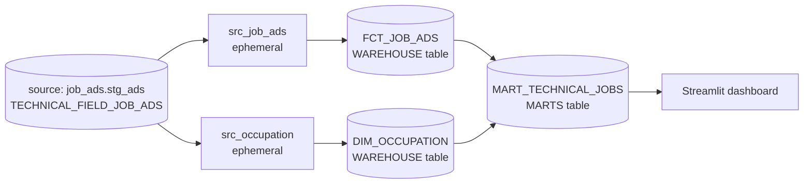

# 6. dbt models and dimensional modeling

## The DAG in dependency order

A **DAG** (directed acyclic graph) is dbt's map of “must run before” relationships. `source()` starts external lineage; each `ref()` both resolves a relation/model and adds an edge, so dbt can order work safely.



## 1. Source-cleaning models

### `10_dbt_modeling/dbt_code/models/src/src_job_ads.sql`

- **Purpose:** select fact-like fields from raw ads.
- **Input:** `source('job_ads', 'stg_ads')`.
- **Transformation:** selects `occupation__label`, renames `number_of_vacancies` to `vacancies`, and retains `relevance` and `application_deadline`; orders by deadline.
- **Output:** no standalone Snowflake object because `src/` is `ephemeral`; its SQL is inserted into downstream compiled SQL as a CTE.
- **Downstream:** `fct_job_ads` uses `ref('src_job_ads')`.

### `10_dbt_modeling/dbt_code/models/src/src_occupation.sql`

- **Purpose:** select occupation descriptors.
- **Input:** the same `source()`.
- **Transformation:** renames concept IDs and labels to cleaner occupation, group, and field columns.
- **Output:** ephemeral, so no table/view.
- **Downstream:** `dim_occupation` uses `ref('src_occupation')`.

## 2. Warehouse fact and dimension

### `10_dbt_modeling/dbt_code/models/fct/fct_job_ads.sql`

- **Purpose:** represent job-ad measurements.
- **Input:** `ref('src_job_ads')`.
- **Transformation:** generates `occupation_id` from the occupation label and retains vacancies, relevance, and deadline.
- **Output:** table `JOB_ADS.WAREHOUSE.FCT_JOB_ADS` due to the folder and project configuration.
- **Downstream:** joined by `mart_technical_jobs` and tested in chapter 7.

**Grain:** judging strictly from the SQL, one output row per input ad row selected by `src_job_ads`. There is no ad ID, deduplication, or primary-key column, so the model cannot enforce or identify a unique ad. `occupation_id` repeats for ads with the same occupation and acts as a dimension foreign key, not a fact primary key.

Measures belong here because `vacancies` and `relevance` describe each ad/event; `application_deadline` is an event attribute useful for time filtering.

### `10_dbt_modeling/dbt_code/models/dim/dim_occupation.sql`

- **Purpose:** one descriptive row per occupation.
- **Input:** `ref('src_occupation')`.
- **Transformation:** groups by occupation, creates the same surrogate `occupation_id`, and selects `max()` group/field values to deduplicate.
- **Output:** table `JOB_ADS.WAREHOUSE.DIM_OCCUPATION`.
- **Downstream:** joined by the mart; target of a relationship test.

**Grain:** one row per distinct occupation string. `occupation_id` is the intended surrogate primary key, although Snowflake/dbt does not enforce it here and no `unique`/`not_null` test currently proves it. The source concept IDs are selected upstream but not retained in this dimension.

Descriptive occupation, group, and field values belong in a dimension because they categorize many fact rows without repeating them in the fact table.

## 3. Reporting mart

### `10_dbt_modeling/dbt_code/models/mart/mart_technical_jobs.sql`

- **Purpose:** consumption-ready job listing data for reporting.
- **Inputs:** `ref('fct_job_ads')` and `ref('dim_occupation')`.
- **Transformation:** left-joins on surrogate `occupation_id`, selects measures plus descriptions/deadline, then filters to `occupation_field = 'Yrken med teknisk inriktning'`.
- **Output:** table `JOB_ADS.MARTS.MART_TECHNICAL_JOBS`.
- **Downstream:** default query in `12_dashboard_streamlit/connect_data_warehouse.py`.

The `WHERE` condition on a right-side dimension column removes unmatched/null dimension rows, so despite `LEFT JOIN`, the final behavior for unmatched facts is effectively inner-join-like.

## Is it a star schema?

It is a small, star-schema-like extract: one fact table joins one occupation dimension and feeds a denormalized mart. The diagram and README in `08_dimensional_modeling/`/`10_dbt_modeling/README.md` discuss a larger intended star (employer, job details, auxiliary attributes), but those models do not exist in the canonical implementation. Do not document or build them as though they were present.

The actual flow is:

```text
raw staging source
  -> two ephemeral projections
  -> one fact table + one occupation dimension
  -> technical-jobs mart
  -> Streamlit metrics and dataframe
```

## Build and verify

```bash
cd 10_dbt_modeling/dbt_code
dbt run
dbt run --select +mart_technical_jobs
dbt show --select mart_technical_jobs --limit 10
```

Then verify physical outputs:

```sql
SHOW TABLES IN SCHEMA JOB_ADS.WAREHOUSE;
SHOW TABLES IN SCHEMA JOB_ADS.MARTS;
SELECT COUNT(*) FROM JOB_ADS.WAREHOUSE.FCT_JOB_ADS;
SELECT COUNT(*) FROM JOB_ADS.WAREHOUSE.DIM_OCCUPATION;
SELECT * FROM JOB_ADS.MARTS.MART_TECHNICAL_JOBS LIMIT 10;
```

Expect no `SRC_JOB_ADS` or `SRC_OCCUPATION` relation because they are ephemeral.
