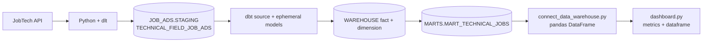

# 8. Serve the mart with Streamlit

## End-of-pipeline files

### `12_dashboard_streamlit/connect_data_warehouse.py`

`load_dotenv(override=True)` reads local `.env` values. `snowflake.connector.connect()` uses user, password, account, warehouse, database, schema, and role variables. `query_job_listings()` defaults to:

```sql
SELECT * FROM mart_technical_jobs
```

Because the connection sets database `JOB_ADS` and schema `MARTS`, this resolves to `JOB_ADS.MARTS.MART_TECHNICAL_JOBS`, created by the canonical dbt mart model. `pandas.read_sql()` executes the query and returns a DataFrame. The context manager closes the connection.

### `12_dashboard_streamlit/dashboard.py`

`layout()` fetches the DataFrame, displays a title/description, and uses three `st.metric` cards for total vacancies and two occupation groups. Snowflake's unquoted column names arrive uppercase, so it accesses `VACANCIES` and `OCCUPATION_GROUP`. `st.dataframe(df)` renders all returned mart rows.

### `12_dashboard_streamlit/run_dashboard.py`

This convenience wrapper finds `dashboard.py` and invokes `streamlit run` through `subprocess`. Direct CLI launch is simpler and exposes Streamlit arguments clearly.

## Configure dashboard identity

First execute the role/user setup explained in chapter 2. Create `12_dashboard_streamlit/.env` locally:

```dotenv
SNOWFLAKE_USER=reporter
SNOWFLAKE_PASSWORD=<LOCAL_SECRET>
SNOWFLAKE_ACCOUNT=<ACCOUNT_IDENTIFIER>
SNOWFLAKE_WAREHOUSE=dev_wh
SNOWFLAKE_DATABASE=job_ads
SNOWFLAKE_SCHEMA=marts
SNOWFLAKE_ROLE=job_ads_reporter_role
```

The connector code currently uses password authentication even though `03_setup_reporter_service_acc.sql` proposes an RSA service user. To use that alternative, deliberately update local/application connection handling for a private key; merely creating the key-based user is insufficient for the checked-in Python.

## Run correctly

```bash
cd 12_dashboard_streamlit
streamlit run dashboard.py
```

Then open the local URL printed by Streamlit. An alternative matching the repository wrapper is:

```bash
python run_dashboard.py
```

Do not use `python dashboard.py` as the normal launch method. It calls `layout()`, but it bypasses Streamlit's CLI/runtime setup; widgets and browser serving may not behave correctly. `streamlit run dashboard.py` starts the web server, executes the script in a Streamlit session, and reruns it when interaction/code changes occur.

## Complete connection chain



## Verify before continuing

Test access before the UI:

```bash
cd 12_dashboard_streamlit
python connect_data_warehouse.py
streamlit run dashboard.py
```

The first command should print DataFrame rows; the second should show three metrics and the listing table. In Snowflake, verify `SHOW GRANTS TO ROLE JOB_ADS_REPORTER_ROLE` and test the fully qualified mart query if connection context is uncertain.
