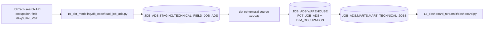

# Modern Data Engineering playbook

This is the rebuild guide for the JobTech job-ad pipeline. It is deliberately ordered by dependency, **not** by lesson-folder number. The implementation in `10_dbt_modeling/` is canonical; `05_users_and_roles/` through `09_setup_dbt/` are learning references, while `11_dbt_testing/` and `12_dashboard_streamlit/` add tests and reporting.

## Recommended reading and build order

1. [Create the repository and Python environment](01_project_setup.md).
2. [Build the Snowflake foundation and access model](02_snowflake_setup.md).
3. [Load JobTech data with dlt](03_dlt_ingestion.md).
4. [Initialize, configure, install, and run dbt](04_dbt_setup.md).
5. [Connect the source and understand macros](05_dbt_sources_and_macros.md).
6. [Build the DAG and understand the dimensional model](06_dbt_models_and_dimensional_modeling.md).
7. [Add and interpret dbt tests](07_dbt_testing.md).
8. [Connect and launch Streamlit](08_streamlit_dashboard.md).
9. [Use the complete rebuild checklist](09_full_pipeline.md).
10. [Diagnose common problems](10_troubleshooting.md).

## The architecture discovered in this repository



The concrete file chain is:

```text
10_dbt_modeling/dlt_code/load_job_ads.py
  -> JOB_ADS.STAGING.TECHNICAL_FIELD_JOB_ADS
  -> 10_dbt_modeling/dbt_code/models/src/sources.yml
  -> src_job_ads.sql + src_occupation.sql (ephemeral)
  -> fct_job_ads.sql + dim_occupation.sql (tables)
  -> mart_technical_jobs.sql (table)
  -> 12_dashboard_streamlit/connect_data_warehouse.py
  -> 12_dashboard_streamlit/dashboard.py
```

## Vocabulary used throughout

- **Warehouse**: Snowflake compute that executes queries; it does not store the rows.
- **Database**: top-level container for schemas and objects.
- **Schema**: namespace inside a database, used here as a pipeline layer.
- **Role**: collection of privileges granted to users or other roles.
- **Service user**: non-human identity used by a pipeline or application.
- **dlt**: Python library that extracts, normalizes, and loads source data.
- **dbt**: transformation tool that compiles templated SQL and executes it in Snowflake.
- **Fact table**: events or measurements at an explicit grain.
- **Dimension table**: descriptive context used to group and explain facts.
- **Mart**: consumption-ready dataset for a specific reporting use case.
- **Macro**: reusable Jinja template that generates SQL or changes dbt behavior.
- **`source()`**: dbt reference to a table created outside dbt.
- **`ref()`**: dbt reference to another model; it also creates a dependency in the DAG.

## What is final, and what is historical?

| Area | Authoritative/recommended source | Supporting learning source |
|---|---|---|
| Access concepts | Final `10_dbt_modeling/sql/` plus the required dlt setup in `07_extract_load_api_dlt/sql/` | `05_users_and_roles/` |
| dlt | `10_dbt_modeling/dlt_code/load_job_ads.py` | CSV in `06_extract_load_csv_dlt/`; query-based API loader in `07_extract_load_api_dlt/` |
| dbt project/models | `10_dbt_modeling/dbt_code/` | initialization examples in `09_setup_dbt/` |
| tests | `11_dbt_testing/dbt_code/models/schema.yml` and its package files | incomplete by design |
| dashboard | `12_dashboard_streamlit/` | final reporting stage |

## Known boundaries

The canonical model is intentionally an extract, not the full star schema proposed in `08_dimensional_modeling/`. The repository has no dependency manifest for the whole Python application and does not track a real `profiles.yml` or dlt secrets. The guide therefore derives installation commands from actual imports, provides templates with placeholders, and calls out every item that must be supplied manually.
